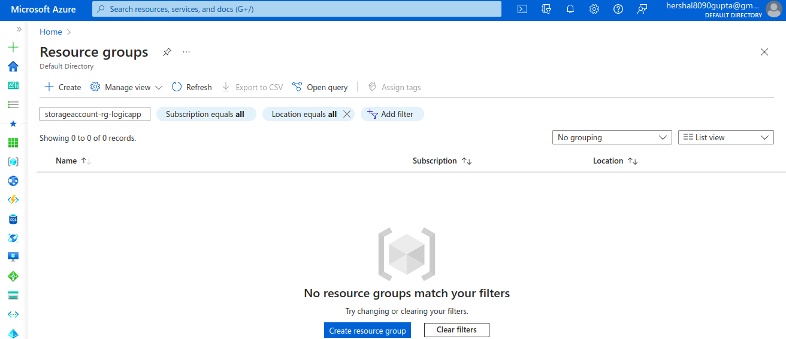

## Description

In this template, We will Invoke the ADO Pipeline using the pipeline ID from the api using the powershell script.

---

### Steps

* Run the powershell script from any IDE or using `./<script-name>.ps1` in terminal.
* Start the Agent , to call ADO pipeline 

---

### Outputs

1. Before executing the script, ADO pipeline status:

2. Before executing the script, Azure resources on Azure Cloud status:

3. Invoking the powershell script to trigger the Pipeline throughb the pipeline ID :

4. After executing the script, ADO pipeline status:

5. After executing the script, Azure resources on Azure Cloud status:

---